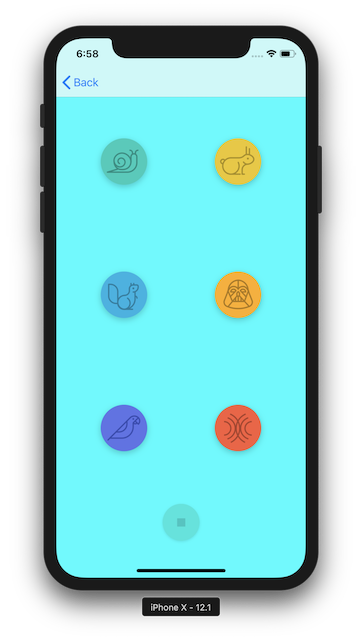

# Pitch-Perfect
Pitch Perfect Udacity Course Project

## Description
This app was created from scratch as an App Challenge from Udacity's iOS Nanodegree Course. 
Pitch Perfect allows the user to record their voice and then play it back with different effects!

#### Objectives
- Create a new project from existing iOS app templates
- Add buttons, images, labels and create user interfaces for the app using the Storyboard
- Leverage the Model View Controller (MVC) design principles; this includes writing custom model code, and using UIViewController, and UIView
- Create Outlet and Action connections between the views and view controllers. Benefit from the power of Delegates by using them in code
- Navigate between two scenes in the app using UINavigationController
- Play audio files using AVFoundation’s AVAudioEngine class

## Screenshots
 

